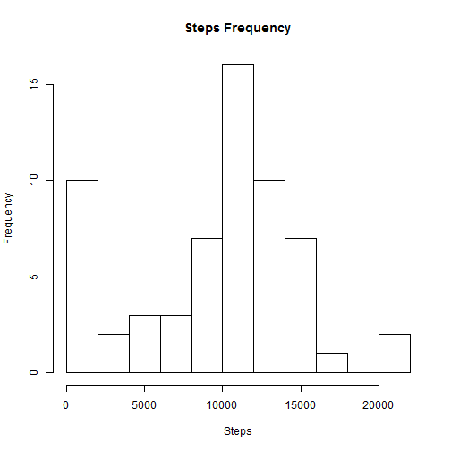
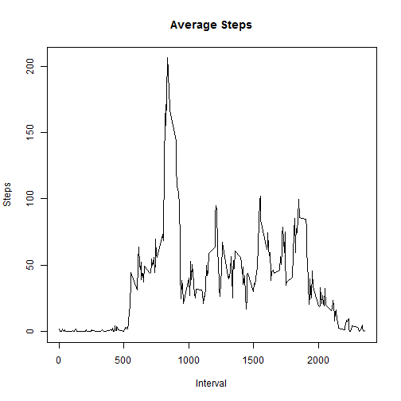
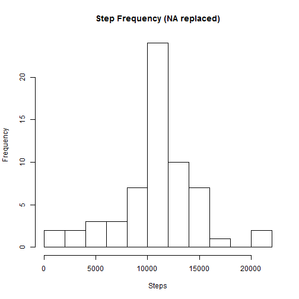
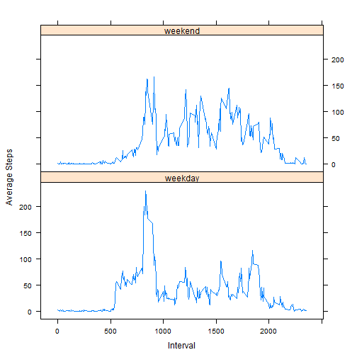

#Loading and  Preprocessing


```r
# 1) Read in data
data = read.csv("./activity.csv", header = T, stringsAsFactors = F)

# 2) Pre-processing: making number of steps a numeric
data$steps = as.numeric(data$steps)
```

#Mean Number of Steps Per day


```r
# 1) Calculate total number of steps per day
steps1 = aggregate(data$steps, by = list(data$date), FUN = sum, na.rm = T)

# 2) Make a histogram
hist(steps1[,2],10, main = "Steps Frequency", xlab = "Steps")
```

 

```r
# 3) Calculate the mean and median number of steps for each day
steps2 = aggregate(data$steps, by = list(data$date), FUN = mean, na.rm = T)
steps3 = aggregate(data$steps, by = list(data$date), FUN = median, na.rm = T)

# Combine into one data frame
totals = cbind(steps2, steps3[,2])

names(totals) = c("Date", "Average Steps", "Median Steps")

totals
```

```
##          Date      Average Steps Median Steps
## 1  2012-10-01                NaN           NA
## 2  2012-10-02  0.437500000000000            0
## 3  2012-10-03 39.416666666666664            0
## 4  2012-10-04 42.069444444444443            0
## 5  2012-10-05 46.159722222222221            0
## 6  2012-10-06 53.541666666666664            0
## 7  2012-10-07 38.246527777777779            0
## 8  2012-10-08                NaN           NA
## 9  2012-10-09 44.482638888888886            0
## 10 2012-10-10 34.375000000000000            0
## 11 2012-10-11 35.777777777777779            0
## 12 2012-10-12 60.354166666666664            0
## 13 2012-10-13 43.145833333333336            0
## 14 2012-10-14 52.423611111111114            0
## 15 2012-10-15 35.204861111111114            0
## 16 2012-10-16 52.375000000000000            0
## 17 2012-10-17 46.708333333333336            0
## 18 2012-10-18 34.916666666666664            0
## 19 2012-10-19 41.072916666666664            0
## 20 2012-10-20 36.093750000000000            0
## 21 2012-10-21 30.628472222222221            0
## 22 2012-10-22 46.736111111111114            0
## 23 2012-10-23 30.965277777777779            0
## 24 2012-10-24 29.010416666666668            0
## 25 2012-10-25  8.652777777777779            0
## 26 2012-10-26 23.534722222222221            0
## 27 2012-10-27 35.135416666666664            0
## 28 2012-10-28 39.784722222222221            0
## 29 2012-10-29 17.423611111111111            0
## 30 2012-10-30 34.093750000000000            0
## 31 2012-10-31 53.520833333333336            0
## 32 2012-11-01                NaN           NA
## 33 2012-11-02 36.805555555555557            0
## 34 2012-11-03 36.704861111111114            0
## 35 2012-11-04                NaN           NA
## 36 2012-11-05 36.246527777777779            0
## 37 2012-11-06 28.937500000000000            0
## 38 2012-11-07 44.732638888888886            0
## 39 2012-11-08 11.177083333333334            0
## 40 2012-11-09                NaN           NA
## 41 2012-11-10                NaN           NA
## 42 2012-11-11 43.777777777777779            0
## 43 2012-11-12 37.378472222222221            0
## 44 2012-11-13 25.472222222222221            0
## 45 2012-11-14                NaN           NA
## 46 2012-11-15  0.142361111111111            0
## 47 2012-11-16 18.892361111111111            0
## 48 2012-11-17 49.788194444444443            0
## 49 2012-11-18 52.465277777777779            0
## 50 2012-11-19 30.697916666666668            0
## 51 2012-11-20 15.527777777777779            0
## 52 2012-11-21 44.399305555555557            0
## 53 2012-11-22 70.927083333333329            0
## 54 2012-11-23 73.590277777777771            0
## 55 2012-11-24 50.270833333333336            0
## 56 2012-11-25 41.090277777777779            0
## 57 2012-11-26 38.756944444444443            0
## 58 2012-11-27 47.381944444444443            0
## 59 2012-11-28 35.357638888888886            0
## 60 2012-11-29 24.468750000000000            0
## 61 2012-11-30                NaN           NA
```

#Average Daily Activity Pattern

```r
# Get the mean number of steps per interval
pat = aggregate(data$steps, by = list(data$interval), FUN = mean, na.rm = T)

# 1) Plot the mean number of steps per interval
plot(pat, type = 'l', main = "Average Steps", xlab = "Interval", ylab = "Steps")
```

 

```r
# 2) Get the interval with the maximum mean number of steps
maxInt = pat[pat[,2] == max(pat[,2]), 1]

maxInt
```

```
## [1] 835
```

#Imputing Missing Values
The missing values are filled with the average value from the original data set of their corresponding 5-minute interval.

```r
# 1) Count the total number of NAs
NAcount = sum(is.na(data))
NAcount
```

```
## [1] 2304
```

```r
# 2) & 3)
# Create second data frame equal to the first
data2 = data

# Find where NAs occur
subs = which(is.na(data2[,1]))

# replace NAs with mean corresponding to their interval tag
for (i in 1:length(subs)){
  
  data2[subs[i],1] = pat[data2$interval[i] == pat[,1], 2]
  
}

# 4) Find the total, mean, and median number of steps per interval
rep1 = aggregate(data2$steps, by = list(data2$date), FUN = sum, na.rm = T)
rep2 = aggregate(data2$steps, by = list(data2$date), FUN = mean, na.rm = T)
rep3 = aggregate(data2$steps, by = list(data2$date), FUN = median, na.rm = T)

hist(rep1[,2], 10, main = "Step Frequency (NA replaced)", xlab = "Steps")
```

 

#Differences in Activity Patterns

```r
# 1)

# Convert date to date type
data2$date = as.Date(data2$date)

# Take the difference of each date and the first date, mod 7
datediff = as.numeric((data2$date - data2$date[1]))%%7

# The first date is a monday, so datediffs from 0-4 will be monday thru friday
# datediffs 5 and 6 will be saturday and sunday
data2$wkdy[datediff %in% 0:4] = "weekday"
data2$wkdy[datediff %in% 5:6] = "weekend"

wkdy = aggregate(data2$steps, by = list(data2$interval, data2$wkdy), FUN = mean)
names(wkdy) = c("interval", "weekday", "steps")

# 2)
library(lattice)
xyplot(wkdy$steps~wkdy$interval | wkdy$weekday, layout = c(1,2), type = 'l', xlab = "Interval", ylab = "Average Steps")
```

 
